# 📘 Sistem Reservasi Antrian Layanan Administrasi Kampus (Q-Campus)

Sistem Informasi Manajemen Antrian berbasis Web App (PWA) yang modern, interaktif, dan real-time. Proyek ini mendemonstrasikan penyelesaian masalah antrian fisik di kampus melalui antarmuka web modern dengan implementasi responsivitas tingkat tinggi, animasi canggih, fitur *scan* kamera, text-to-speech, dan Web Push Notification.

---

## 👥 Anggota Kelompok

1. Inez Dea Ariska — STI202303642  
2. Rido Kurniawan — STI202303434  
3. Andrean Syah Putra — STI202303719  
4. Turiman — STI202303581    
5. Fani Amalia — STI202303653  

---

**Hasil deploy website (vercel) :**  

🌐 [Campus-Q antrian berbasis website](https://tugas-besar-backend.vercel.app/)


## 🚀 Fitur, Alur Penggunaan, dan Logika Koding

Aplikasi ini memiliki 2 peran (*Role*) utama: **Mahasiswa** (pengguna layanan) dan **Admin** (pengelola layanan). Di bawah ini adalah alur penggunaan beserta penjelasan dan potongan logika (*snippet*) kodenya baik dari sisi *Frontend* maupun *Controller Backend/Database*.

### 1. Landing Page & Autentikasi
Menyambut pengguna dengan antarmuka dinamis dan *layout* yang adaptif, dilanjutkan dengan alur masuk/daftar.
<p align="center">
  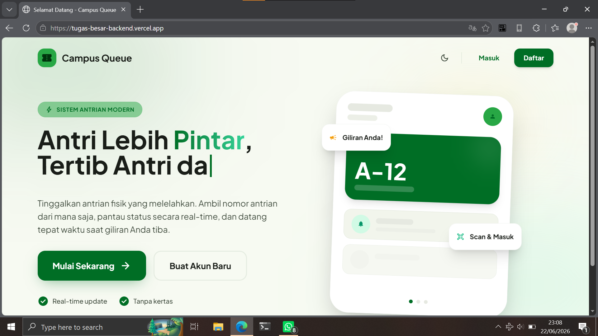
  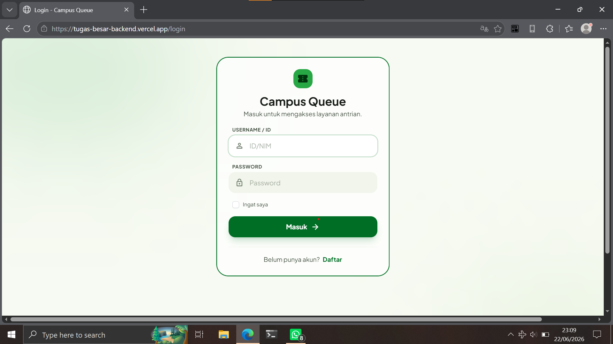
</p>
<p align="center">
  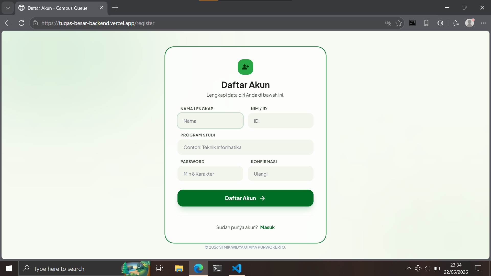
</p>

**💡 Logika Koding: GSAP, Grid Order & Controller Auth**
Animasi pengetikan ditangani GSAP. Tata letak HP diatur lewat *Order* Grid CSS. Pintu masuk akun menggunakan sistem Eloquent & `Auth::attempt` Laravel.

```javascript
// Frontend: Animasi GSAP Typing
gsap.to("#typewriter", { duration: 2, text: "Antri Lebih Pintar,", repeat: -1, yoyo: true });
```
```php
// Backend Controller: Register & Login Authentication
User::create(['nim' => $request->nim, 'password' => Hash::make($request->password)]);

if (Auth::attempt(['nim' => $request->nim, 'password' => $request->password])) {
    $request->session()->regenerate();
    return redirect()->intended('/mahasiswa/dashboard');
}
```

---

### 2. Dashboard Mahasiswa (PWA & Dark Mode)
Sistem mendukung fitur global **Dark Mode** secara utuh dan reaktif.
<p align="center">
  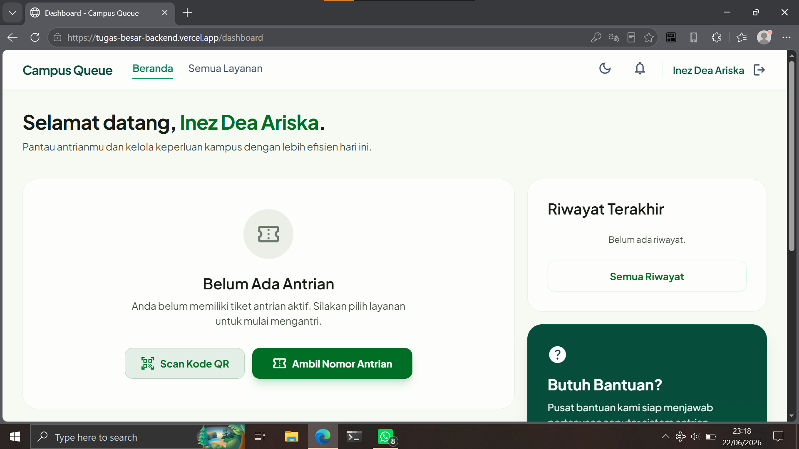
  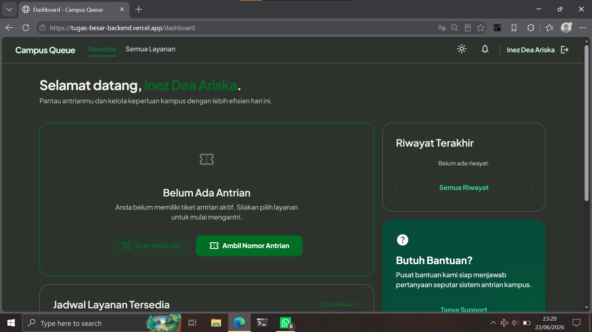
</p>

**💡 Logika Koding: Dark Mode State & Relasi Eloquent**
Peralihan tema dikendalikan Alpine.js dan *LocalStorage*. Di sisi Backend, data jadwal diambil berdasarkan hari saat ini beserta relasi tabel Layanannya.

```html
<!-- Frontend: Toggle Alpine.js tersinkronisasi dengan browser storage -->
<html x-data="{ darkMode: localStorage.getItem('theme') === 'dark' }" 
      x-init="$watch('darkMode', v => localStorage.setItem('theme', v ? 'dark' : 'light'))" 
      :class="{ 'dark': darkMode }">
```
```php
// Backend Controller: Mengambil Jadwal Aktif & Ketersediaan Kuota
$jadwalHariIni = Jadwal::with('layanan')->where('hari', now()->locale('id')->dayName)->get();
```

---

### 3. Pengambilan Antrian (Scan QR Code & Manual)
Mahasiswa dapat melihat daftar layanan, lalu memindai QR Code dari kamera HP langsung di *browser*.
<p align="center">
  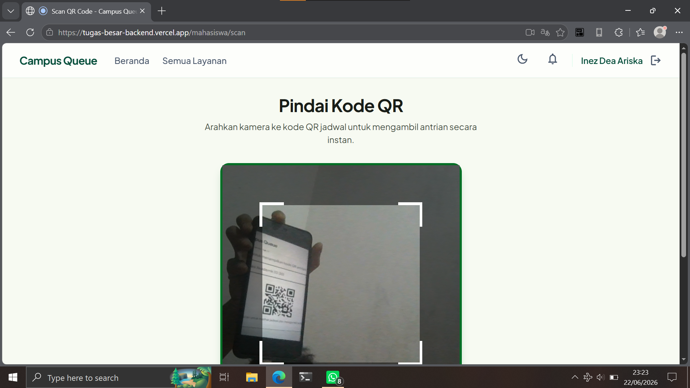
  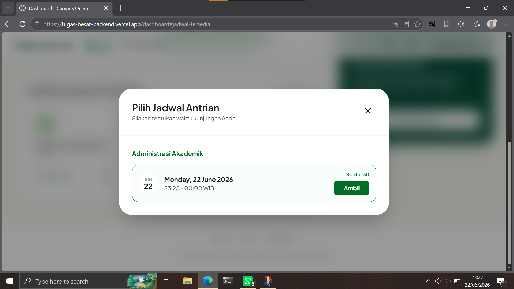
  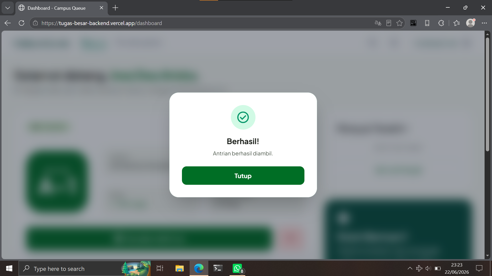
</p>

**💡 Logika Koding: AJAX Post & Controller Insert Database**
Kamera dikontrol `html5-qrcode`. Jika QR terdeteksi, algoritma backend akan meracik nomor urut terbaru dan memasukkannya ke *Database*.

```javascript
// Frontend: Ekstrak ID dari QR dan POST via Fetch
let urlParams = new URLSearchParams(decodedText.split('?')[1]);
fetch('/mahasiswa/antrian', { method: 'POST', body: JSON.stringify({ layanan_id: urlParams.get('layanan_id') }) });
```
```php
// Backend Controller: Generate Nomor Urut Otomatis & Insert Antrian Baru
$lastAntrian = Antrian::where('jadwal_id', $jadwal->id)->max('nomor_urut');

Antrian::create([
    'user_id' => Auth::id(),
    'jadwal_id' => $jadwal->id,
    'nomor_urut' => $lastAntrian + 1,
    'status' => 'menunggu'
]);
```

---

### 4. Real-Time Status & Push Notification (Service Worker)
Ketika dipanggil, UI Mahasiswa otomatis menampilkan popup dan **Notifikasi Sistem Operasi** berbunyi (lengkap dengan aksi tombol).
<p align="center">
  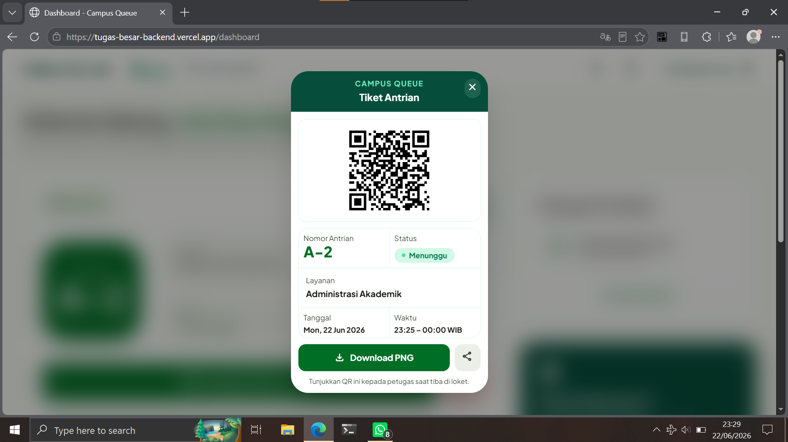
  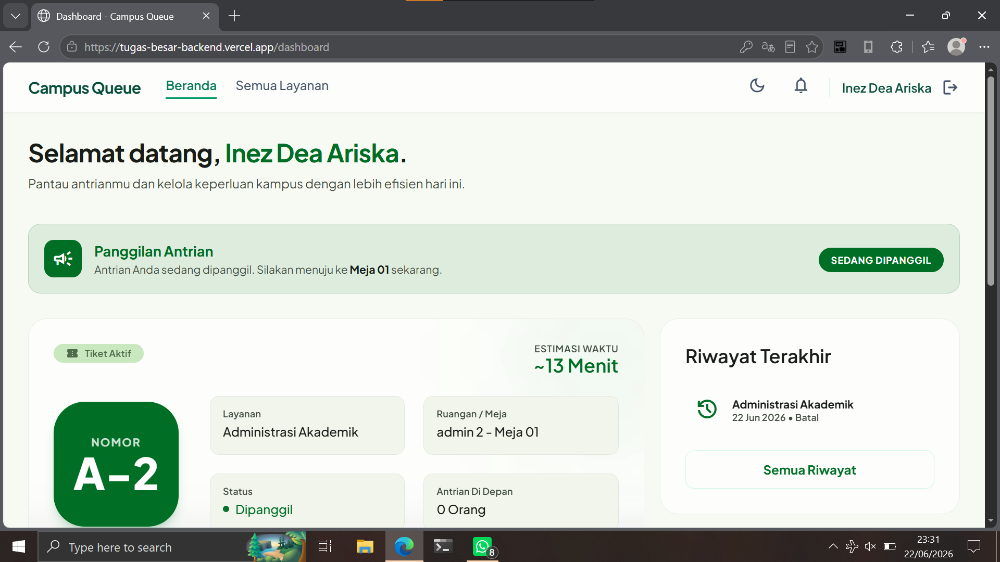
</p>
<p align="center">
  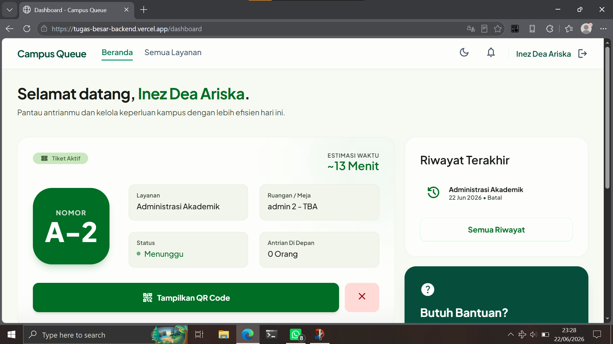
</p>

**💡 Logika Koding: Controller Query & Service Worker Action**
Menggunakan *Long-Polling* Javascript ke Controller yang mencari data dengan spesifik status `dipanggil`.

```php
// Backend Controller: API Polling Check Status Antrian
return response()->json(
    Antrian::where('user_id', Auth::id())->where('status', 'dipanggil')->first()
);
```
```javascript
// Frontend: Membuka Push Notification OS (Bypass Blokir Android)
navigator.serviceWorker.ready.then(reg => {
    reg.showNotification("Panggilan!", {
        body: `Nomor A-${data.nomor} silakan ke Loket.`,
        actions: [{ action: 'oke', title: 'Oke, Menuju Kesana' }]
    });
});
```

---

### 5. Manajemen Antrian Admin & Fitur Text-to-Speech
Browser admin akan otomatis menjadi "speaker" pemanggil antrian.
<p align="center">
  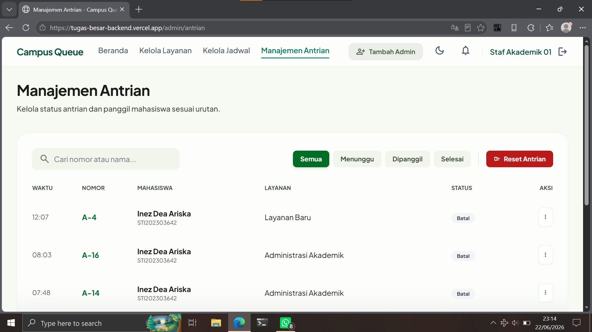
  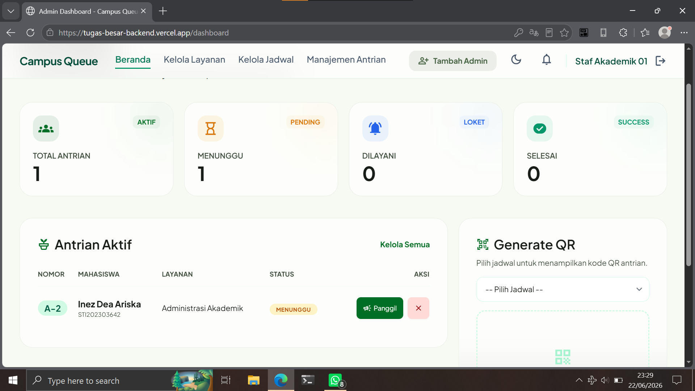
</p>
<p align="center">
  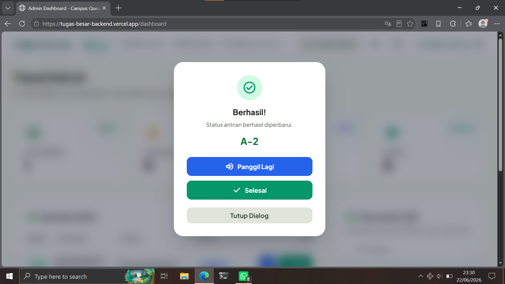
  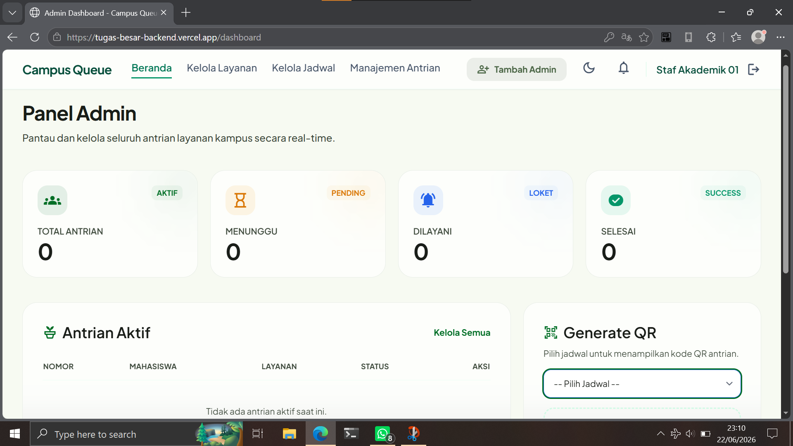
</p>

**💡 Logika Koding: Update Database & ResponsiveVoice Synthesis**
Admin mengklik "Panggil", Database berubah state, dan hasil *Response* langsung dibaca oleh sistem AI Audio browser.

```php
// Backend Controller: Update Status menjadi Dipanggil
$antrian->update(['status' => 'dipanggil']);
return response()->json(['nomor' => $antrian->nomor_urut, 'loket' => $antrian->jadwal->loket]);
```
```javascript
// Frontend: Sintesis Respon JSON Backend menjadi Suara Manusia
let text = `Nomor antrian, A-${data.nomor}, silakan menuju ke ${data.loket}`;
responsiveVoice.speak(text, "Indonesian Female", { rate: 0.85, volume: 1 });
```

---

### 6. Kelola Data & Generate QR Code (Admin)
Setiap jadwal yang dibuat dapat dicetak menjadi sebuah QRCode untuk dipindai (*scan*).
<p align="center">
  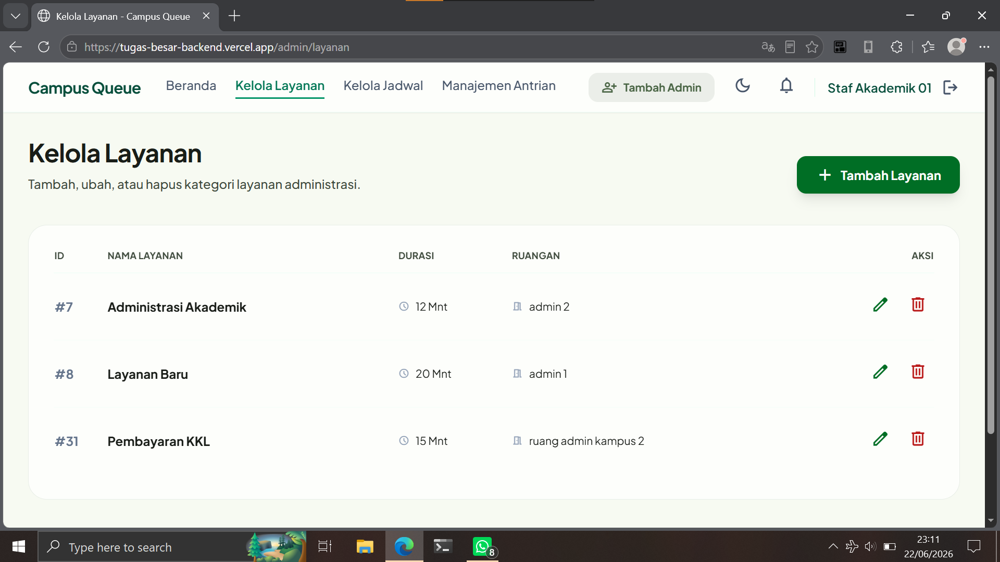
  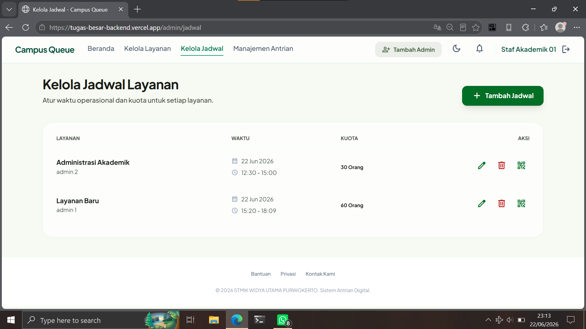
  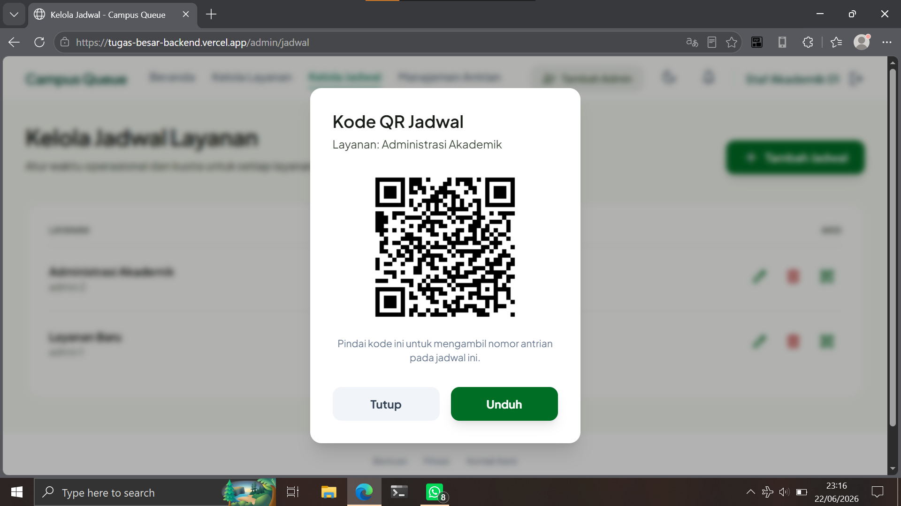
</p>
<p align="center">
  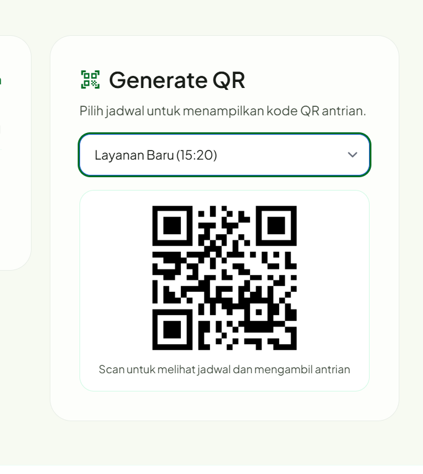
  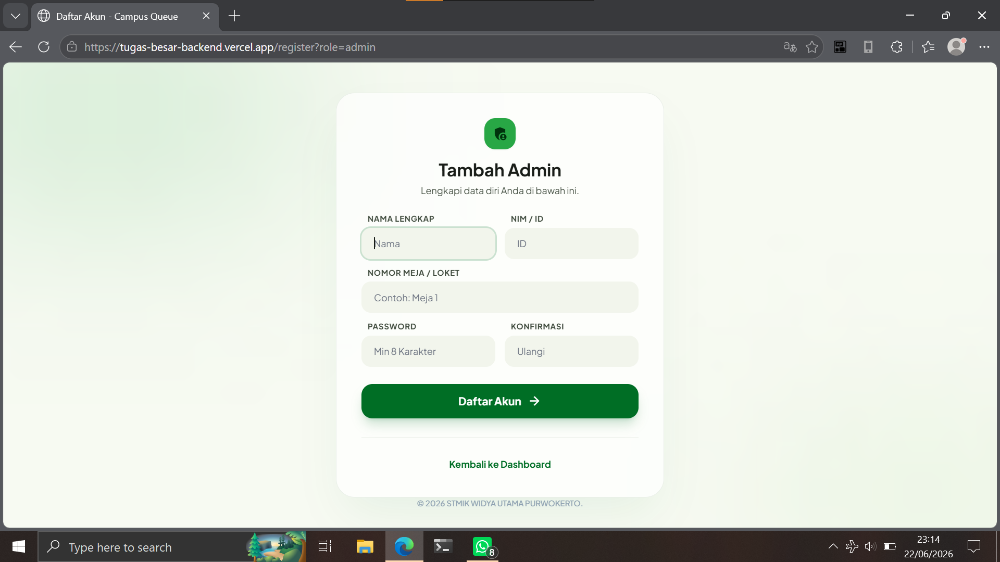
</p>

**💡 Logika Koding: CRUD Controller & QrCode Frontend**
Master data dilindungi dengan validasi bawaan Laravel. Pembuatan QR Code murni dilakukan lewat Javascript Client-Side.

```php
// Backend Controller: Standardisasi CRUD & Validasi
Layanan::create($request->validate([
    'nama_layanan' => 'required|string|max:255',
    'deskripsi'    => 'nullable|string'
]));
```
```javascript
// Frontend: Render Objek QR secara langsung di Browser (Anti-Lag Server)
let qr = qrcode(0, 'M');
qr.addData(`${urlAplikasi}?action=scan&layanan_id=${jadwalId}`);
qr.make();
document.getElementById('qr-container').innerHTML = qr.createImgTag(6);
```

---

## 🛠️ Tech Stack & Alat Lingkungan
- **Backend Framework:** Laravel 11 (PHP 8.2), MySQL / Eloquent ORM
- **Frontend & CSS:** Tailwind CSS v3, Konsep *Glassmorphism* UI
- **DOM Scripting / Modals:** Alpine.js (komunikasi Modals lintas *Views* memakai `x-data`)
- **Animations:** GSAP (`Timeline` & `TextPlugin`)
- **Fitur Khusus:** ResponsiveVoice (TTS), Service Worker (Notifikasi PWA HP), HTML5-Qrcode (Akses Kamera QR)
- **Deployment & Hosting Setup:** File `vercel.json` dikonfigurasi untuk menyesuaikan aturan kompilasi PHP-Serverless di infrastruktur *hosting* Vercel secara langsung.
